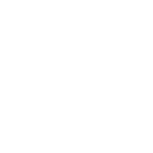
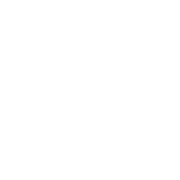
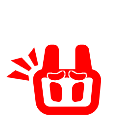
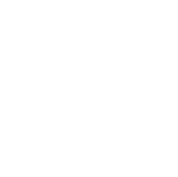
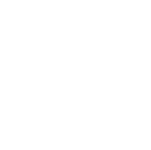
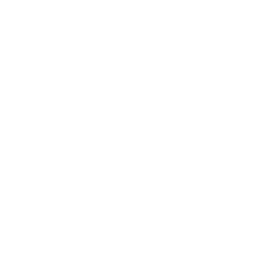
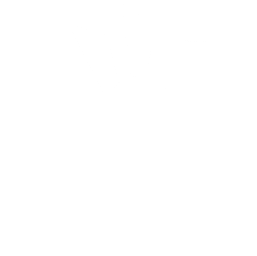

# OttoIconChanger
OttoIconChanger is a mod made for modifying the Otto icon in the game A Dance Of Fire and Ice.

## Features
* **No Nervous Otto** - Otto will no longer be nervous when playing fast level.
* **No Dark Otto** - Otto will no longer be dark when off.
* **Otto Color Changer** - Modify the color of the Otto image.
* **Otto Opacity Changer** - Modify the transparency of the Otto image.
* **Otto Position Changer** - Modify the location of the Otto button.
* **Otto Size Changer** - Modify the size of Otto.
* **Custom Otto Image** - Change the appearance of Otto by importing image(s).

## Guide on how to use Custom Otto Image

* **For Non-Animated Images:** 
Input or browse for the path to the image (e.g., path1/path2/image.png) for the Otto state you'd like to change and then hit "Apply". 

* **For Animated Images:** 
To make Otto animate. Choose an animated file of your choice (e.g., .gif or .mp4) and turn the video into each seperate frame images. A website for this I recommend is [reaConverter](https://online.reaconverter.com/). Once you have all the frames of your desired animated source as each individual images. Name them all the same with their proper index, for example, name1.png, name2.png, etc... and put all the frames into a folder. Finally direct the ingame path into that folder and click "Apply". Currently, only .png, .jpg and .jpeg frames image type are supported. .jpg and .jpeg will not support transparency channel and so if they do have one, it will be turned to black pixels!!

* Each state have a default state assigned, allowing you to reuse images for unassigned states. For example, if you set the default state for "NervousOn" to "On," the mod will use the image assigned to the "On" state. If no image is assigned to "On," the game will default to its original image.

* Tip: Try to use too much frames as it can cause loading issue. Make sure there's no duplicated frames (e.g. 100 frames but in reality only 50 is needed for the full animation) and if you plan to use the same animation for multiple state then choose one state to load it and set the default state of the other states to the chosen state.

## Otto States

On:

Off:
(Nervous uses the same image)

Nervous On:

Left On:
(Nervous uses the same image)

Left Off:
(Nervous uses the same image)

Right On:
(Nervous uses the same image)

Right Off:
(Nervous uses the same image)

Pet:
(Nervous uses the same image)

Miss:
(Nervous uses the same image)
