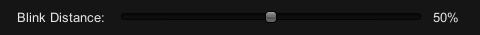
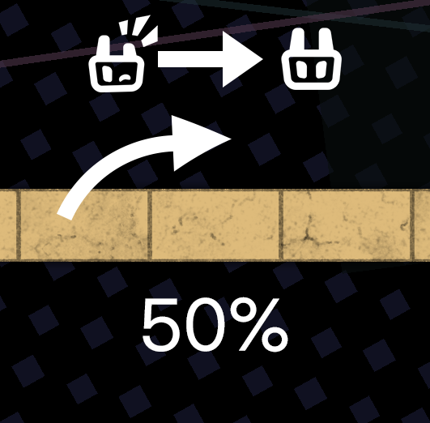
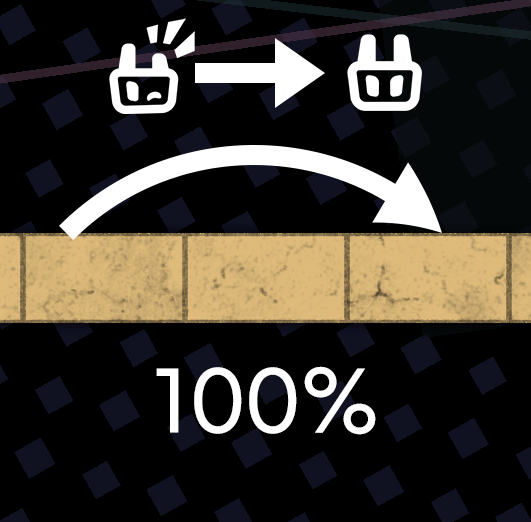
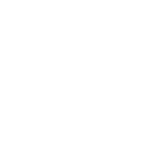
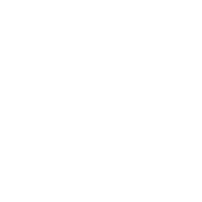

# OttoIconChanger
OttoIconChanger is a mod made for modifying the Otto icon in the game A Dance Of Fire and Ice.

## Features
* **Hide Autoplay Text** - The "Autoplay" text will no longer appear, there are, however countermeasure against those, who wish to use this to cheat so don't try :)
* **No Nervous Otto** - Otto will no longer be nervous when playing fast level. (It won't become red and uses Nervous Otto Sprites)
* **No Dark Otto** - Otto will no longer be dark when off.
* **Otto Color Changer** - Modify the color of the Otto image.
* **Otto Opacity Changer** - Modify the transparency of the Otto image.
* **Otto Position Changer** - Modify the location of the Otto button.
* **Otto Size Changer** - Modify the size of Otto.
* **Custom Otto Image** - Change the appearance of Otto by importing image(s) or video(s).

## Guide on how to use Custom Otto Image

### **For static Otto:** 
* Input or browse for the path to the image (e.g., path1/path2/image.png) for the Otto state you'd like to change and then hit "Apply". 

### **For animated Otto:** 
* Input or browse for the path to the image (e.g., path1/path2/image.png) for the Otto state you'd like to change and then hit "Apply". 

* **Old/Alternative Method:**
To make Otto animate. Choose an animated file of your choice (e.g., .gif or .mp4) and turn the video into each seperate frame images. A website for this I recommend is [reaConverter](https://online.reaconverter.com/). Once you have all the frames of your desired animated source as each individual images. Name them all the same with their proper index, for example, name1.png, name2.png, etc... and put all the frames into a folder. Finally direct the ingame path into that folder and click "Apply". Currently, only .png, .jpg and .jpeg frames image type are supported. .jpg and .jpeg will not support transparency channel and so if they do have one, it will be turned to black pixels!!

* Tip: Please refrain from using long videos or folders with too many frames, since - unless your computer is a beast - it will just crash. A good limit would be roughly 50 frames or 1-2 looping GIF/Video.

### **Additional Info**
* Each state have a default state, that can be assigned, allowing you to reuse images for unassigned states. For example, if you set the default state for "NervousOn" to "On", the mod will use the image assigned to the "On" state. If no image is assigned to "On", the game will default to its original image.

### **Presets:** 
* You can create a preset(s) of the current profile or a fresh default one, type in the name and it will save all settings into a button.
* You can also modify the preset after selecting, make sure to click Update Preset!!!

### **Blink Distance:**

* You can adjust how long you want Otto to stay in the blink state after hitting a tile. Here are some examples:

 

## Otto States

On & Off:

 

Nervous On & Off (Instead of White, Red):

 

Left On & Off (Nervous uses the same image):

 

Right On & Off (Nervous uses the same image):

 

Pet:  Miss: 